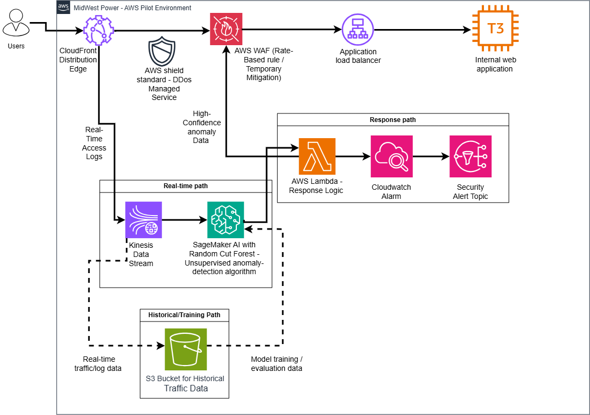

# AI-Assisted DDoS Detection and Mitigation on AWS

**Scenario-based cloud security + machine learning architecture case study**  
**Focus:** AWS architecture, DDoS mitigation, anomaly detection, performance engineering, compliance, observability, and project delivery

> **Portfolio note:** This is a scenario-based proof-of-concept design and implementation plan, not a production deployment for a real utility. The project demonstrates the technical decisions, validation strategy, and delivery planning I would use to evaluate an AI-assisted DDoS defense architecture in AWS.

## Project Snapshot

| Area | Design choice |
|---|---|
| Environment | Isolated AWS proof of concept |
| Application compute | Amazon EC2 `t3.medium` |
| Edge/security | Amazon CloudFront, AWS Shield Standard, AWS WAF |
| Data streaming | Amazon Kinesis Data Streams |
| Machine learning | Amazon SageMaker AI Random Cut Forest |
| Response | AWS Lambda + AWS WAF |
| Observability | Amazon CloudWatch + Amazon SNS |
| Historical data | Amazon S3 with retention and versioning controls |
| Performance target | 1,000 requests/second for 5 minutes |
| Detection target | Qualifying anomaly within 20 seconds |
| Timeline | 8 weeks |
| Project estimate | $74,500 against a $75,000 pilot budget |

## The Challenge

The scenario involves a regional power utility experiencing increased distributed denial-of-service (DDoS) attacks against customer-facing portals and internal systems. The goal was to design a small but functional AWS proof of concept that could:

- detect abnormal web traffic using machine learning;
- initiate controlled mitigation without giving the model unrestricted authority;
- preserve access for legitimate users during unusual traffic spikes;
- operate entirely outside production customer and operational-technology systems;
- collect enough performance, security, and cost evidence to support a future enterprise decision.

## Architecture

## Full Case Study

For the complete architecture, testing methodology, security controls, project requirements, risks, and design decisions:

👉 **[View the Technical Case Study PDF](documentation/AI_Assisted_DDoS_AWS_Portfolio_Final.pdf)**

---

### Application Path

`Synthetic Users → CloudFront → AWS Shield Standard / AWS WAF → Application Load Balancer → EC2 t3.medium`

The representative customer portal is hosted on an EC2 `t3.medium` instance. I treated this as a **testable compute baseline**, not a predetermined production sizing answer.

### Real-Time Detection Path

`CloudFront Real-Time Logs → Kinesis Data Streams → Processed Numerical Observations → SageMaker Random Cut Forest`

CloudFront telemetry is streamed into the detection pipeline and processed into numerical observations. SageMaker Random Cut Forest (RCF), an unsupervised anomaly-detection algorithm, assigns anomaly scores based on how strongly new observations differ from learned baseline patterns.

A key design decision was to treat an anomaly score as a **security signal rather than proof of malicious intent**. Traffic crossing a validated threshold is forwarded into a controlled response path instead of allowing the ML model to directly make unrestricted infrastructure changes.

### Response and Observability

`Qualifying Anomaly → AWS Lambda → AWS WAF`

`CloudWatch → SNS Security Notification`

AWS Lambda handles qualifying anomaly events and interacts with configured WAF controls. Amazon CloudWatch records system and response activity, while Amazon SNS provides security notifications.

### Historical Data and Model Integrity

Amazon S3 stores historical traffic, anomaly results, and model-evaluation data. The design avoids uncontrolled continuous retraining: suspected malicious data is separated from reviewed legitimate baseline data before periodic model retraining.

S3 lifecycle controls support a **30-day post-project retention policy**, and S3 Versioning supports recovery from accidental object overwrite or deletion.

## Performance Engineering

I designed C1 performance testing around five explicit metrics:

| Metric | Acceptance / evidence |
|---|---|
| Detection latency | Qualifying anomaly score within **20 seconds** |
| Throughput | Sustain **1,000 requests/second for 5 minutes** without violating the detection-latency target |
| CPU utilization | Average EC2 CPU utilization remains below **70%** |
| Memory utilization | EC2 memory utilization remains below **80%** |
| Network performance | Network utilization remains within the supported capacity of the `t3.medium` without sustained failed requests |

CloudWatch monitors CPU, `NetworkIn`, `NetworkOut`, and CPU-credit behavior. The CloudWatch Agent collects operating-system memory utilization.

The important engineering outcome is not that the `t3.medium` must pass. If the workload produces sustained resource saturation, the POC should provide evidence to resize the compute tier.

## Security and Compliance Validation

The validation plan covers more than DDoS detection alone:

- **Encryption:** verify S3 server-side encryption and encrypted supported service paths.
- **Access control:** test authorized and unauthorized IAM identities against protected resources.
- **Data retention:** verify S3 lifecycle configuration for the 30-day post-project policy.
- **Backup/recovery:** overwrite or delete a test object and restore the previous S3 version.
- **Ethical testing:** generate a high-volume legitimate traffic event and verify the system minimizes false-positive mitigation.
- **Privacy:** verify that no production customer information enters the POC environment.

## Delivery Plan

The project is organized into eight weeks:

1. **Planning and design** — requirements, architecture, isolation controls, schedule.
2. **Cloud environment** — IAM, EC2, ALB, CloudFront, WAF.
3. **Data pipeline** — CloudFront real-time logging, Kinesis, preprocessing, S3.
4. **ML development** — RCF training, anomaly-threshold validation, real-time scoring.
5. **Response and observability** — Lambda, WAF integration, CloudWatch, CloudWatch Agent, SNS.
6. **System testing** — performance, functionality, compliance, ethical, and legal tests.
7. **Remediation and acceptance** — defect correction, retesting, acceptance criteria.
8. **Closeout** — configuration documentation, ML evaluation, final recommendations.

Every WBS task was assigned a specific start and end date, with milestones mapped to the delivery schedule.

## Budget and Risk Management

The project estimate is **$74,500**, compared with the scenario's **$75,000** pilot budget, representing a **$500 favorable variance (~0.67%)**.

Primary risks addressed in the plan include:

- false-positive blocking of legitimate users;
- detection latency exceeding 20 seconds;
- EC2 compute-resource saturation;
- IAM or AWS configuration errors;
- cloud-cost overruns;
- schedule delays;
- contaminated training data.

## What This Project Demonstrates

- **AWS Solution Architecture:** CloudFront, WAF, Shield Standard, ALB, EC2, Kinesis, SageMaker, Lambda, CloudWatch, SNS, S3, IAM.
- **Cloud Security Engineering:** DDoS defense, least privilege, encryption, controlled response, isolation, and data protection.
- **Applied Machine Learning:** unsupervised anomaly detection, baseline modeling, threshold validation, retraining controls, and model evaluation.
- **Performance Engineering:** latency, throughput, CPU, memory, networking, and burst-credit monitoring.
- **Observability and Response:** metrics, alarms, notifications, mitigation evidence, and defect/retest workflows.
- **Technical Project Planning:** requirements traceability, WBS, dated schedule, budget, quality management, risk management, and acceptance criteria.

## If I Extended the POC

I would next evaluate infrastructure-as-code, longer-duration load testing, richer operational dashboards, comparison with alternative anomaly-detection methods, autoscaling or non-burstable compute options, human approval gates for high-impact mitigation, and multi-region resilience.

---

**Cybersecurity | AWS | Cloud Security | AI/ML | Systems Engineering**

